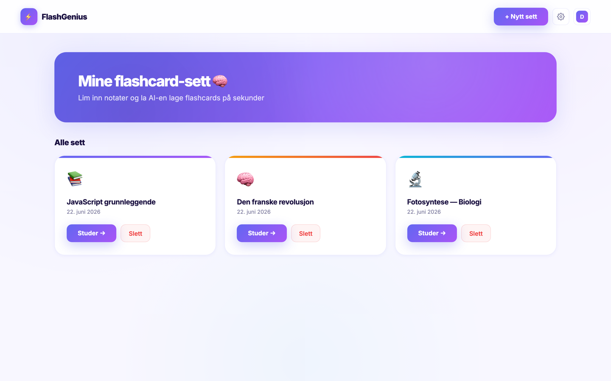

  

  

  
  
  

## About Me

Computer Science student at the University of Oslo (`Informatikk: programmering og systemarkitektur`), with two years completed. I like building practical, polished software — from Android apps to full-stack web apps with AI integration.

## Tech Stack

  

  Kotlin • Java • Python • React • FastAPI • PostgreSQL • Android • Git

## Featured Projects

<table>
  <tr>
    <td width="50%" valign="top">
      <h3>⚡ FlashGenius</h3>
      
      

        A full-stack AI study tool that turns your notes (or PDFs) into
        <b>flashcards, quizzes, summaries, and interactive mind maps</b> in seconds.
        Includes user accounts, a personal library, light/dark mode, and live AI generation.
      

      
<b>Stack:</b> React · FastAPI · PostgreSQL · Groq (Llama 3.1)

      

        🔗 <a href="https://flash-genius-vvo5.vercel.app">Live demo</a> ·
        <a href="https://github.com/arink1305/FlashGenius">Code</a>
      

    </td>
    <td width="50%" valign="top">
      <h3>🌊 Splæsh</h3>
      
      

        An Android bathing app for Norway that helps users find and rate swimming spots using
        weather maps, point forecasts, hazard warnings, UV data, and a bathing score.
      

      
<b>Stack:</b> Kotlin · Android

      

        <a href="https://github.com/arink1305/splaesh">Code</a> 
        <b>My role:</b> hazard &amp; UV API integration, weather map, bathing score and recommendation UI.
      

    </td>
  </tr>
</table>

## Education

**University of Oslo** — Informatics: Programming and System Architecture
Two years completed, focused on programming, software structure, and system-oriented thinking.

  
  

  

