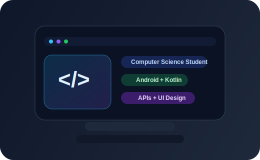

  

  

  

## About Me

<table>
  <tr>
    <td width="58%" valign="top">
      <ul>
        <li>Computer Science student at the University of Oslo <code>Informatikk: programmering og systemarkitektur</code></li>
        <li>Completed 2 years of study in programming and system-oriented subjects</li>
        <li>Interested in software development, Android apps, API integration, and maintainable architecture</li>
        <li>I enjoy building practical products with polished UI and clear structure</li>
        <li>Currently growing my portfolio through hands-on programming projects</li>
      </ul>

    </td>
    <td width="42%" valign="top">
      
    </td>
  </tr>
</table>

---

## Tech Stack

  

---

## Featured Project

### Splæsh

Splæsh is an Android bathing app for Norway that helps users find and evaluate swimming spots using weather maps, point forecasts, hazard warnings, UV data, recommendations, and a bathing score.

Repository: [github.com/arink1305/splaesh](https://github.com/arink1305/splaesh)

  

#### What I worked on

- design and visual polish
- hazard warnings API integration
- UV API integration
- work on the Victoria weather map integration
- bathing score UI and behavior
- recommendation features and UX

#### Screenshots

Replace the placeholders below with real screenshots from the app when you're ready.

- `Map overview`
- `Weather layers and time scroller`
- `Beach details and bathing score`

<!-- Example:

-->

---

## Education

**University of Oslo**  
Informatics: Programming and System Architecture

- completed 2 years of study
- focused on programming, software structure, and system-oriented thinking

---

## Contact

- Email: [arink1305@gmail.com](mailto:arink1305@gmail.com)
- GitHub: [github.com/arink1305](https://github.com/arink1305)
