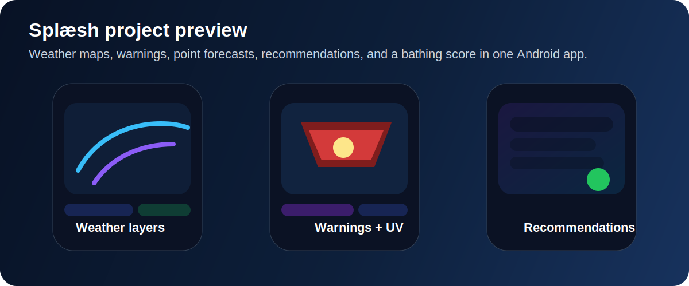

  

  

  

  
  
  

## About Me

  

- Computer Science student at the University of Oslo
- Completed 2 years of `Informatikk: programmering og systemarkitektur`
- Interested in software development, Android apps, API integration, and maintainable architecture
- I enjoy building practical products with polished UI and clear structure
- Currently growing my portfolio through hands-on programming projects

---

## Tech Stack

  

---

## Featured Project

### Splæsh

Splæsh is an Android bathing app for Norway that helps users find and evaluate swimming spots using weather maps, point forecasts, hazard warnings, UV data, recommendations, and a bathing score.

Repository: [github.com/arink1305/splaesh](https://github.com/arink1305/splaesh)

  

  

#### What I worked on

- design and visual polish
- hazard warnings API integration
- UV API integration
- work on the Victoria weather map integration
- bathing score UI and behavior
- recommendation features and UX

#### Screenshots

  

I can replace the rest of this section with the real app screenshots as soon as the actual image files are available locally.

- `Map overview`
- `Settings`
- `Recommendations`

<!-- Example:

-->

---

## Education

**University of Oslo**  
Informatics: Programming and System Architecture

- completed 2 years of study
- focused on programming, software structure, and system-oriented thinking

---

## Contact

  
  
  

- Email: [arink1305@gmail.com](mailto:arink1305@gmail.com)
- GitHub: [github.com/arink1305](https://github.com/arink1305)
- LinkedIn: [arin-kehreman-8573403a4](https://www.linkedin.com/in/arin-kehreman-8573403a4/)
