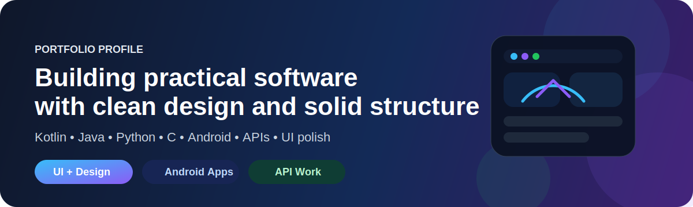
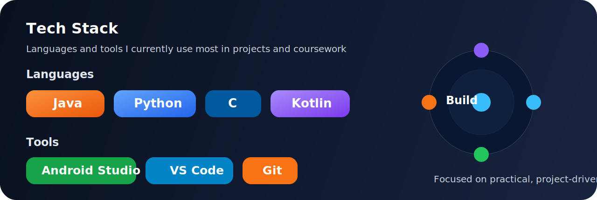
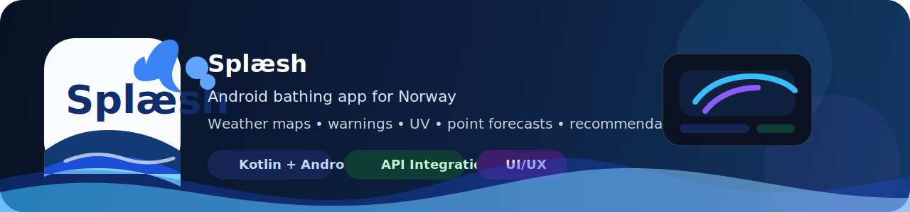
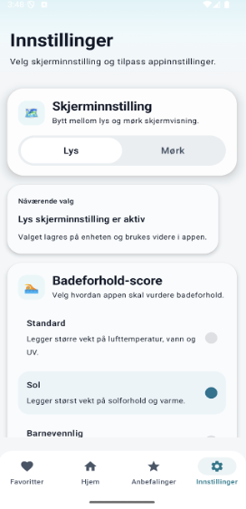
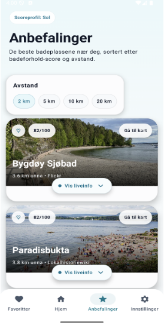

  

  

  
  
  

  

## About Me

I am a Computer Science student at the University of Oslo, currently studying `Informatikk: programmering og systemarkitektur`.
I like building practical software with clean structure, solid API integration, and polished user experiences.

- Completed 2 years of computer science studies at `UiO`
- Interested in software development, Android apps, APIs, and maintainable architecture
- Enjoy working on practical projects that combine code quality and good design
- Currently building a stronger portfolio through hands-on development

  

## Tech Stack

  

  

  Kotlin • Java • Python • C • Android Studio • VS Code • Git

## Featured Project

### Splæsh

Splæsh is an Android bathing app for Norway that helps users find and evaluate swimming spots using weather maps, point forecasts, hazard warnings, UV data, recommendations, and a bathing score.

Repository: [github.com/arink1305/splaesh](https://github.com/arink1305/splaesh)

  

#### What I worked on

- design and visual polish
- hazard warnings API integration
- UV API integration
- work on the Victoria weather map integration
- bathing score UI and behavior
- recommendation features and UX

#### App Screenshots

<table>
  <tr>
    <td align="center" width="25%">
       
      <b>Map overview</b>
    </td>
    <td align="center" width="25%">
       
      <b>Settings</b>
    </td>
    <td align="center" width="25%">
       
      <b>Recommendations</b>
    </td>
    <td align="center" width="25%">
       
      <b>Favorites</b>
    </td>
  </tr>
</table>

## Education

**University of Oslo**  
Informatics: Programming and System Architecture

- completed 2 years of study
- focused on programming, software structure, and system-oriented thinking

## Contact

- Email: [arink1305@gmail.com](mailto:arink1305@gmail.com)
- GitHub: [github.com/arink1305](https://github.com/arink1305)
- LinkedIn: [linkedin.com/in/arin-kehreman-8573403a4](https://www.linkedin.com/in/arin-kehreman-8573403a4/)

  

