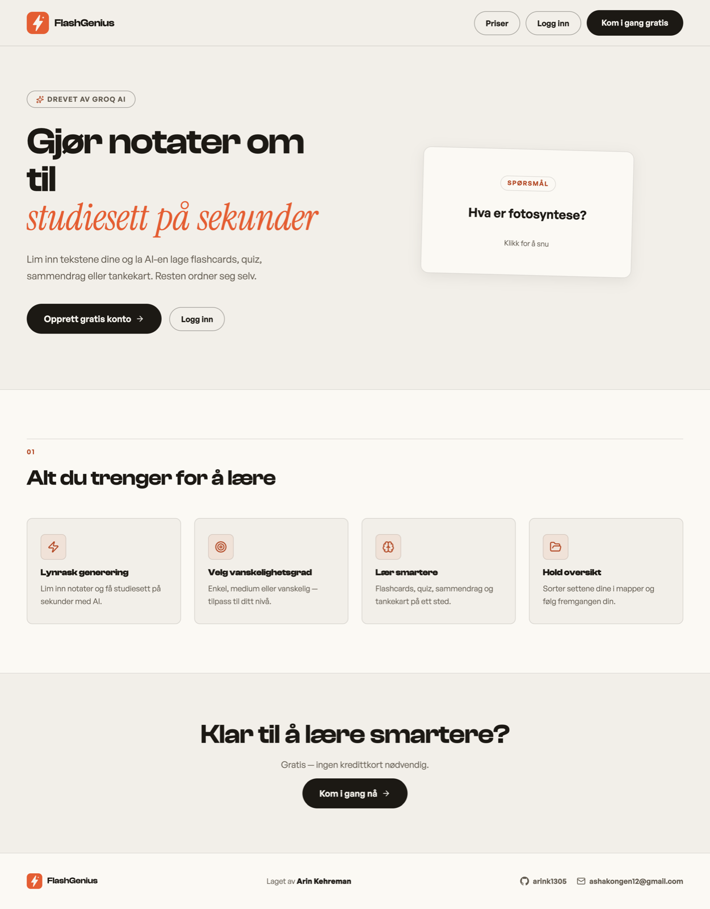
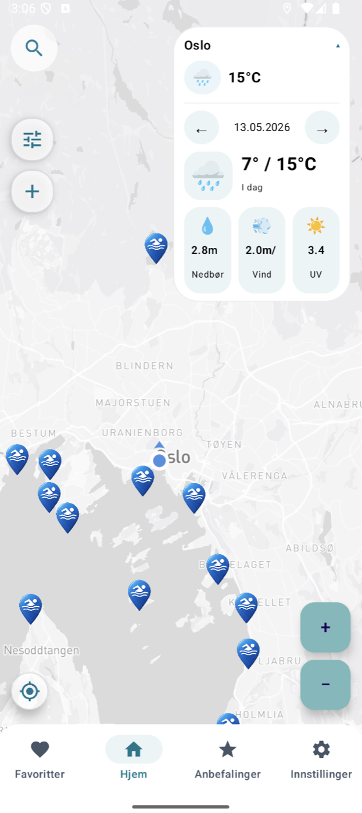
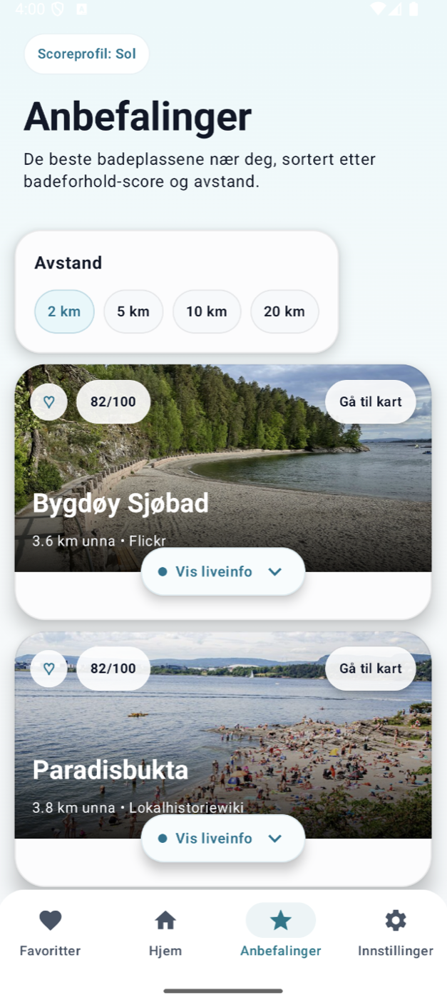
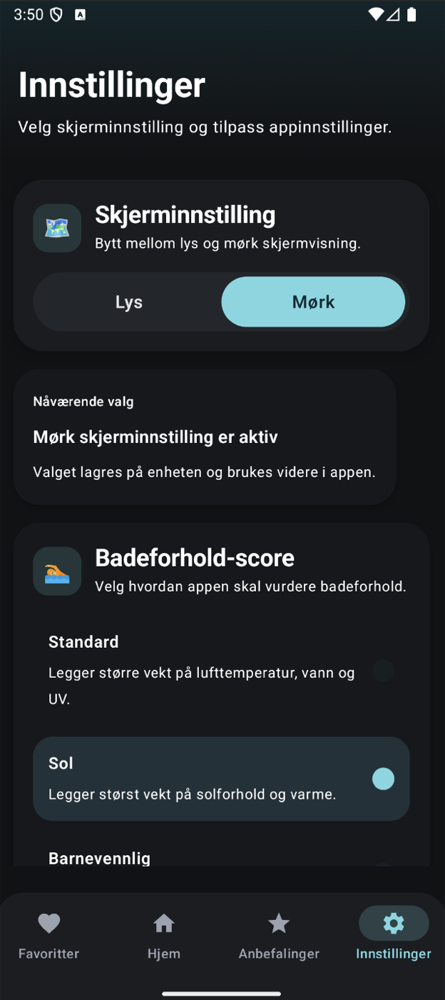
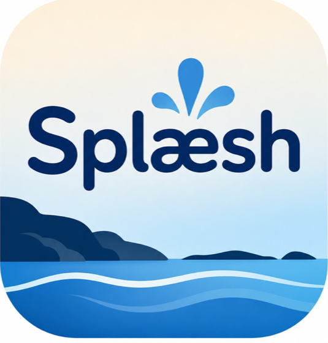
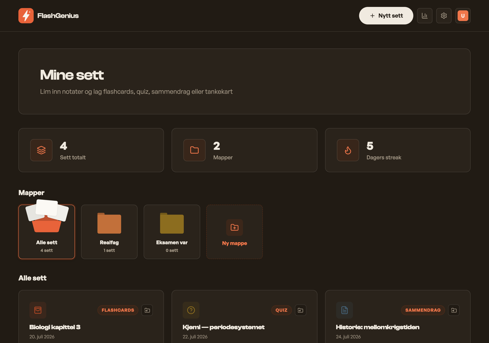
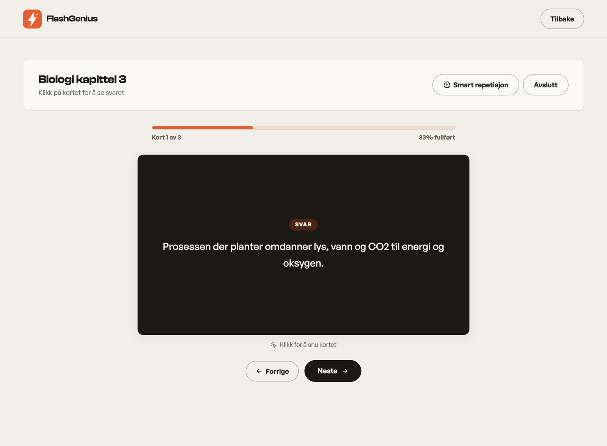

 

I study Informatics at the **University of Oslo** — two years completed, focused on programming, system-oriented thinking and software architecture. I like building things that are actually finished: the empty states, the error handling and the small details, not just the happy path. Right now I am looking for my first role in IT.

  &nbsp;
  &nbsp;
  

 

## 01 · Featured projects

<table>
  <tr>
    <td width="50%" valign="top" align="center">
      
        
      
      <h3>FlashGenius</h3>
      
<i>Turn your notes into flashcards, quizzes, summaries and interactive mind maps — with AI.</i>

      
Built end to end: React frontend, FastAPI backend, PostgreSQL, Stripe-powered plans, and an SM-2 spaced-repetition engine that schedules each card right before you forget it. Ships light and dark mode, Norwegian and English.

      
<code>React</code> <code>FastAPI</code> <code>PostgreSQL</code> <code>Stripe</code> <code>Groq / Llama</code>

      

        &nbsp;
        
      

    </td>
    <td width="50%" valign="top" align="center">
      
        
      
      <h3>Splæsh</h3>
      
<i>Find bathing places in Norway — weather, sea data and a bathing score on one map.</i>

      
A team project built in Kotlin with Jetpack Compose. I worked on design polish, warnings and UV integration, parts of the weather map, and the UX around the bathing score and recommendations.

      
<code>Kotlin</code> <code>Jetpack Compose</code> <code>Mapbox</code> <code>Retrofit</code> <code>MVVM</code>

      

        
      

    </td>
  </tr>
</table>

<table>
  <tr>
    <td width="50%"></td>
    <td width="50%"></td>
  </tr>
</table>

Everything ships with a light and a dark theme built on the same warm paper-and-ink palette.

 

## 02 · What I work with

<table>
  <tr>
    <td><b>Languages</b></td>
    <td><code>Kotlin</code> <code>Java</code> <code>Python</code> <code>JavaScript</code> <code>C</code> <code>SQL</code> <code>HTML / CSS</code></td>
  </tr>
  <tr>
    <td><b>Frontend</b></td>
    <td><code>React</code> <code>Vite</code> <code>Jetpack Compose</code> <code>framer-motion</code> <code>plain CSS</code></td>
  </tr>
  <tr>
    <td><b>Backend</b></td>
    <td><code>FastAPI</code> <code>PostgreSQL</code> <code>REST APIs</code> <code>JWT auth</code> <code>Stripe</code></td>
  </tr>
  <tr>
    <td><b>Mobile</b></td>
    <td><code>Android</code> <code>Jetpack Compose</code> <code>MVVM</code> <code>Coroutines</code> <code>Retrofit</code></td>
  </tr>
  <tr>
    <td><b>Tools</b></td>
    <td><code>Git</code> <code>Android Studio</code> <code>VS Code</code> <code>Figma</code> <code>Docker</code></td>
  </tr>
</table>

 

## 03 · Education

**University of Oslo** — Informatics: Programming and System Architecture

Two years completed. Coursework in programming, algorithms, software structure, databases and system-oriented thinking, alongside hands-on project work — most of it shipped in the projects above.

 

## 04 · Get in touch

  &nbsp;
  &nbsp;
  

